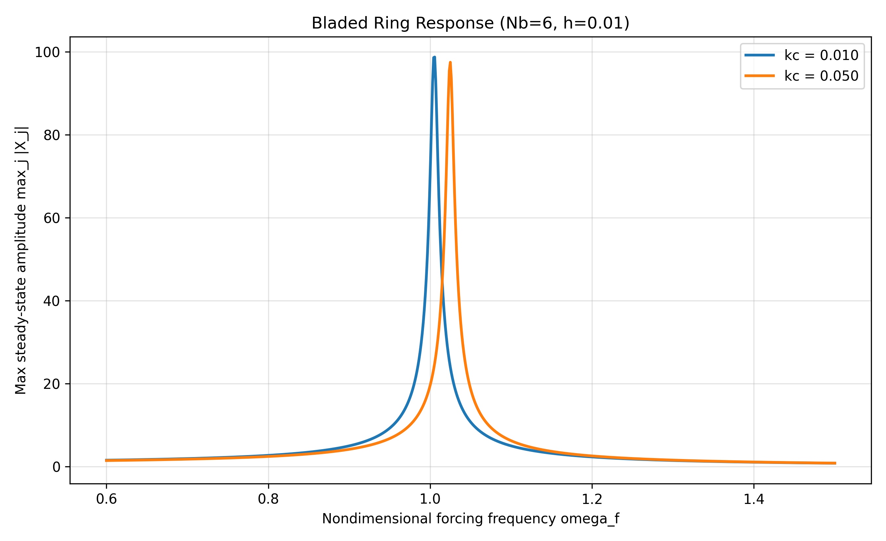
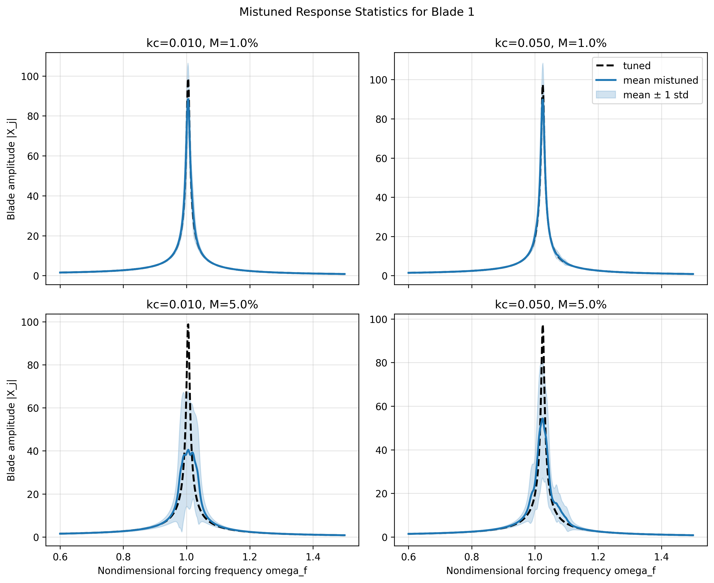
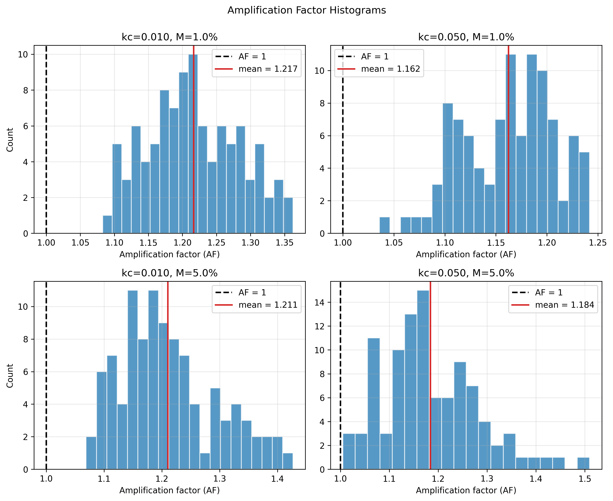
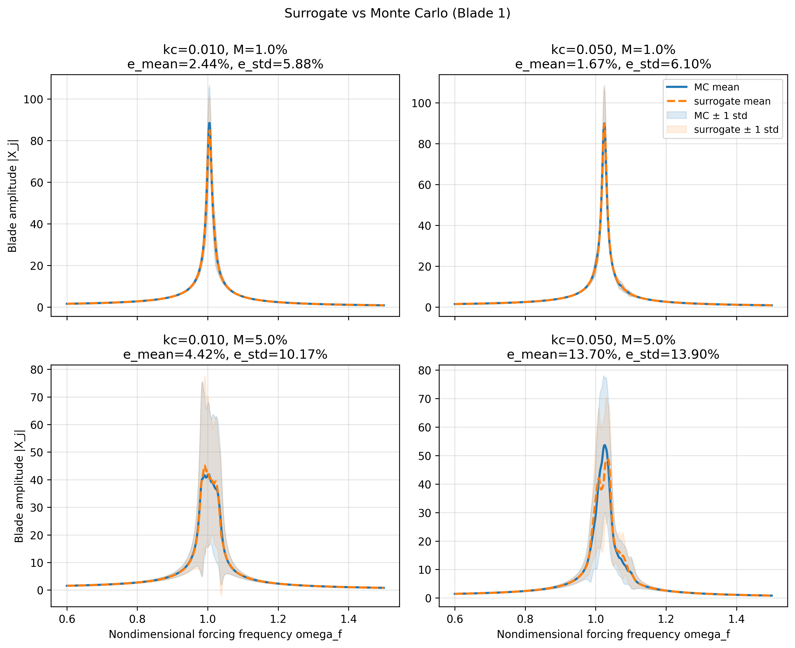

# ENGR 6311 Project Report
## Forced Response of Tuned and Mistuned Bladed Disks

**Course:** ENGR 6311 - Vibrations in Machines and Structures  
**Student:** Mukund Rajamony  
**Institution:** Concordia University  
**Date:** April 2026

---

## Executive Summary

This report develops and studies a cyclic bladed-disk model. Each blade is represented by one degree of freedom, neighboring blades are coupled by elastic links, and the system is excited by a traveling-wave forcing pattern. The report compares tuned and mistuned assemblies, quantifies statistical behavior under random mistuning, evaluates amplification-factor distributions, and introduces a simple surrogate model to reduce computational effort.

Main findings:

1. Increasing coupling stiffness shifts tuned resonance to higher nondimensional frequency.
2. Mistuning breaks cyclic symmetry and causes nonuniform blade response and localization.
3. The worst-case response in mistuned systems is consistently larger than in tuned systems for the tested cases.
4. Amplification-factor histograms show non-negligible probability of severe response amplification.
5. A quadratic surrogate model reproduces Monte Carlo trends well for mild mistuning and remains useful for moderate mistuning.

---

## Nomenclature

- $N_b$: number of blades
- $u_j(t)$: physical generalized displacement of blade $j$
- $x_j(t)$: nondimensional generalized displacement of blade $j$
- $m_0, k_0, h_0$: baseline mass, stiffness, and damping parameters
- $c_0$: interblade coupling stiffness
- $\delta m_j, \delta k_j$: blade-wise mass and stiffness mistuning
- $F_0, \Omega$: forcing amplitude and forcing frequency
- $h = \dfrac{h_0}{\sqrt{k_0 m_0}}$: nondimensional damping
- $k_c = \dfrac{c_0}{k_0}$: nondimensional coupling
- $\omega_f = \dfrac{\Omega}{\sqrt{k_0/m_0}}$: nondimensional forcing frequency

---

## Part I. Model Formulation

### 1. Traveling-Wave Forcing and Mistuning

The traveling-wave force on blade $j$ is

$$
f_j(t) = F_0 \cos\left(\Omega t - \frac{2\pi j}{N_b}\right).
$$

Mistuned blade properties are

$$
m_j = m_0(1+\delta m_j), \qquad k_j = k_0(1+\delta k_j).
$$

The dimensional blade equation is

$$
m_j\ddot{u}_j + h_0\dot{u}_j + k_j u_j + c_0(2u_j-u_{j+1}-u_{j-1}) = F_0 \cos\left(\Omega t - \frac{2\pi j}{N_b}\right).
$$

Cyclic boundary conditions:

$$
u_0=u_{N_b}, \qquad u_{N_b+1}=u_1.
$$

### 2. Nondimensional Form

Define

$$
x_j = \frac{k_0}{F_0}u_j, \qquad t = \tau\sqrt{\frac{k_0}{m_0}}, \qquad h = \frac{h_0}{\sqrt{k_0m_0}}, \qquad k_c=\frac{c_0}{k_0}, \qquad \omega_f=\frac{\Omega}{\sqrt{k_0/m_0}}.
$$

The nondimensional governing equation is

$$
(1+\delta m_j)\ddot{x}_j + h\dot{x}_j + (1+\delta k_j)x_j + k_c(2x_j-x_{j+1}-x_{j-1}) = \cos\left(\omega_f t - \frac{2\pi j}{N_b}\right), \quad j=1,\dots,N_b.
\tag{1}
$$

### 3. Complex Steady-State Form

Assume

$$
\mathbf{x}(t)=\Re\{\mathbf{X}e^{i\omega_f t}\}, \qquad \mathbf{f}(t)=\Re\{\hat{\mathbf{F}}e^{i\omega_f t}\},
$$

with

$$
\hat{F}_j=e^{-i2\pi j/N_b}.
$$

Then

$$
\mathbf{Z}(\omega_f)\mathbf{X}=\hat{\mathbf{F}}, \qquad \mathbf{Z}(\omega_f)=-\omega_f^2\mathbf{M}+i\omega_f\mathbf{C}+\mathbf{K}.
$$

Tuned case:

$$
\mathbf{M}=\mathbf{I}, \qquad \mathbf{C}=h\mathbf{I}, \qquad
\mathbf{K}_{\text{tuned}}=(1+2k_c)\mathbf{I}-k_c(\mathbf{P}+\mathbf{P}^T).
$$

Mistuned case:

$$
\mathbf{M}_{\text{mist}}=\mathrm{diag}(1+\delta m_1,\dots,1+\delta m_{N_b}),
$$
$$
\mathbf{C}_{\text{mist}}=h\mathbf{I},
$$
$$
\mathbf{K}_{\text{mist}}=\mathbf{K}_{\text{tuned}}+\mathrm{diag}(\delta k_1,\dots,\delta k_{N_b}).
$$

---

## Part II. Tuned Assembly Response

Study conditions:

- $N_b=6$
- $h=0.01$
- $0.6 \le \omega_f \le 1.5$
- weak coupling: $k_c=0.01$
- moderate coupling: $k_c=0.05$

Response metric:

$$
A(\omega_f)=\max_j |X_j(\omega_f)|.
$$

**Figure 1.** Tuned response for weak and moderate coupling.

### Numerical Peak Summary (Tuned)

| Coupling case | $k_c$ | $\omega_{f,\text{peak}}$ | $\max_j|X_j|$ |
|---|---:|---:|---:|
| Weak coupling | 0.01 | 1.0056 | 98.756 |
| Moderate coupling | 0.05 | 1.0249 | 97.495 |

Interpretation: increasing coupling shifts resonance toward higher frequency while maintaining a narrow resonant peak due to low damping.

---

## Part III. Mistuned Assembly Studies

### Part III(a). Deterministic Mistuned Case

Given

$$
\delta m_j=0, \qquad \delta k_j = Mr_j,
$$

with

$$
M=0.01, \qquad r_j=\{0.91,-0.03,0.60,-0.72,-0.16,0.83\},
$$

so

$$
\delta k=\{0.0091,-0.0003,0.0060,-0.0072,-0.0016,0.0083\}.
$$

**Figure 2.** Mistuned deterministic response for both coupling values.

| Coupling case | $k_c$ | $\omega_{f,\text{peak}}$ | $\max_j|X_j|$ | Increase vs tuned |
|---|---:|---:|---:|---:|
| Weak coupling | 0.01 | 1.0056 | 116.271 | 17.7% |
| Moderate coupling | 0.05 | 1.0249 | 112.199 | 15.1% |

### Part III(b). Monte Carlo Statistics

For each case, 100 random mistuned assemblies were simulated for $M=1\%$ and $M=5\%$. For blade $j$:

$$
\bar{A}_j(\omega_f)=\mathbb{E}[|X_j(\omega_f)|], \qquad \sigma_j(\omega_f)=\sqrt{\mathbb{V}[|X_j(\omega_f)|]}.
$$

**Figure 3.** Monte Carlo statistics for blade 1 (mean and $\pm1\sigma$).

| Mistuning magnitude | $k_c$ | $\omega_{f,\text{peak}}$ | $\bar{A}_j$ at peak | $\sigma_j$ at peak | Tuned amplitude at same frequency |
|---|---:|---:|---:|---:|---:|
| 1% | 0.01 | 1.0043 | 88.391 | 18.053 | 98.622 |
| 1% | 0.05 | 1.0249 | 89.863 | 18.555 | 97.495 |
| 5% | 0.01 | 1.0056 | 40.498 | 27.045 | 98.756 |
| 5% | 0.05 | 1.0236 | 54.307 | 27.201 | 95.450 |

### Part III(c). Amplification Factor

Define amplification factor

$$
AF = \frac{\max_{j,\omega_f}|X_j^{\text{mist}}(\omega_f)|}{\max_{j,\omega_f}|X_j^{\text{tuned}}(\omega_f)|}.
$$

#### Part III(a) AF values

| Coupling case | $k_c$ | AF | AF percent increase |
|---|---:|---:|---:|
| Weak coupling | 0.01 | 1.177 | 17.7% |
| Moderate coupling | 0.05 | 1.151 | 15.1% |

#### AF histograms for Part III(b) random sets

**Figure 4.** AF distributions for $M=1\%$ and $M=5\%$ under both coupling values.

| Mistuning magnitude | $k_c$ | Mean AF | Std. dev. | Max AF (sample) | Mean AF percent increase |
|---|---:|---:|---:|---:|---:|
| 1% | 0.01 | 1.216 | 0.067 | 1.362 | 21.6% |
| 1% | 0.05 | 1.162 | 0.045 | 1.242 | 16.2% |
| 5% | 0.01 | 1.211 | 0.084 | 1.427 | 21.1% |
| 5% | 0.05 | 1.184 | 0.098 | 1.510 | 18.4% |

**Headline metric:** the worst observed amplification in this study is a 51.0% increase ($AF_{\max}=1.510$) at $M=5\%$ and $k_c=0.05$.

---

## Part IV. Summary of Findings

1. Tuned resonance behavior is structured by cyclic symmetry and coupling strength.
2. Mistuning breaks symmetry, creates blade-to-blade variability, and can localize response.
3. For the deterministic mistuned set, worst-case response increases in both coupling cases.
4. Statistical variability increases with mistuning magnitude, and response uncertainty becomes significant.
5. Global worst-case amplification can increase even when average single-blade response decreases.
6. Amplification factor is a conservative and practical risk metric for vibration durability screening.

---

## Part V. Efficient Alternatives to Direct Monte Carlo

Direct Monte Carlo can be expensive for high-fidelity bladed-disk models. Practical alternatives include reduced-order models, adaptive sampling, and surrogate models.

### Part V(b). Surrogate Approximation of Mistuning Statistics

A simple polynomial surrogate was used to approximate blade response statistics at each frequency:

$$
|X_j| \approx b_0 + \sum_i b_i\delta k_i + \sum_i c_i\delta k_i^2.
$$

Procedure:

1. Train on 30 full-model samples per case.
2. Evaluate on 3000 surrogate samples.
3. Compare against 100-sample direct Monte Carlo.

**Figure 5.** Surrogate and direct Monte Carlo mean/$\pm1\sigma$ comparison for blade 1.

| Mistuning magnitude | $k_c$ | Mean-curve relative $L_2$ error | Std-curve relative $L_2$ error | Peak mean pointwise error | Peak std pointwise error |
|---|---:|---:|---:|---:|---:|
| 1% | 0.01 | 2.44% | 5.88% | 4.62% | 11.32% |
| 1% | 0.05 | 1.67% | 6.10% | 5.25% | 16.02% |
| 5% | 0.01 | 4.42% | 10.17% | 11.43% | 22.85% |
| 5% | 0.05 | 13.70% | 13.90% | 23.72% | 28.57% |

Recommended usage: use the surrogate model for fast screening and uncertainty sweeps, then validate only the highest-risk operating points with direct Monte Carlo or full-order simulations.

---

## Reproducibility Notes

All computations and figures in this report were generated from:

- `Project/blade_model.py`
- `Project/figures/response_nb6_h001_kc001_005.png`
- `Project/figures/mistuned_response_nb6.png`
- `Project/figures/mistuning_statistics_nb6.png`
- `Project/figures/af_histograms_nb6.png`
- `Project/figures/surrogate_vs_mc_nb6.png`
